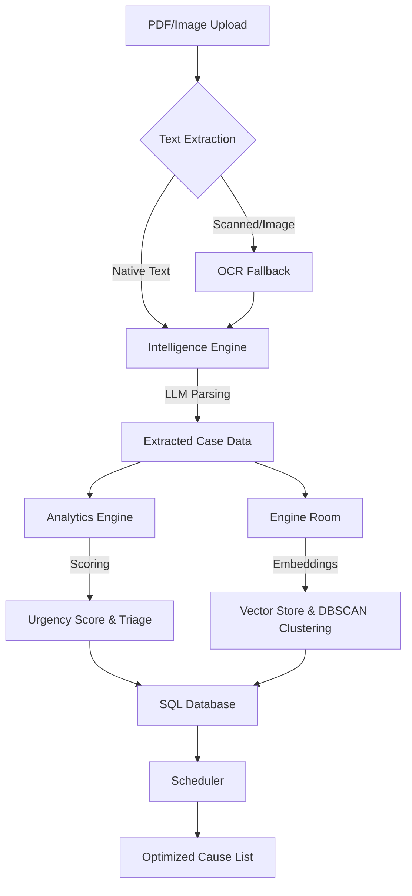

# Nyaya Sarthi - Court Case Prioritization Engine

This project is a court case prioritization and scheduling assistant designed to help tackle case backlogs in courts. It processes case documents (like FIRs and petitions) using OCR and LLMs, calculates an urgency score, clusters similar cases, and generates an optimized cause list.

## Core Features

* **Intelligent Registry**: A Streamlit dashboard to manage and sort incoming cases.
* **Urgency Scoring**: Dynamically calculates a prioritization score based on case age, urgency, and humanitarian factors.
* **Case Clustering**: Groups cases with similar legal questions together so a judge can hear them in a single batch.
* **Auto Cause List**: Automatically generates a daily schedule based on priority scores and adjournment risks.
* **OCR Support**: Uses Tesseract to process scanned PDFs or images if text extraction fails.
* **LLM Integration**: Works with Groq, Ollama, and Hugging Face with automatic failover.

## Data Flow & AI Pipeline

Here is how a document is processed from ingestion to schedule generation:



### Steps:
1. **Intake & OCR**: Upload a PDF case file. The engine extracts the text. If it is a scanned image, it triggers Tesseract OCR.
2. **AI Information Extraction**: The text goes to the LLM (Groq or Ollama) to parse out the title, petitioner, respondent, case type, and a short summary.
3. **Scoring**: Calculates an urgency score out of 100 based on case age, category, and humanitarian flags (like senior citizens or custody cases).
4. **Embeddings & Vector Database**: Computes embeddings using Sentence Transformers and saves them in ChromaDB.
5. **Clustering**: Runs DBSCAN on case embeddings to cluster similar legal matters together.
6. **Scheduling**: Generates the cause list by combining priority scores and clustered matters.

## Tech Stack

* **Backend**: FastAPI, SQLAlchemy, SQLite
* **Frontend**: Streamlit, Plotly
* **LLM**: Groq (Llama 3.1), Ollama (Local), Hugging Face Fallback
* **Embeddings**: Sentence Transformers (MiniLM-L6)
* **Vector DB**: ChromaDB
* **OCR**: Tesseract OCR
* **PDF Processing**: PDFPlumber, PyMuPDF

## Project Structure

```
court_ai_judiciary/
├── app/                        # FastAPI Backend
│   ├── database/               # DB connections & session
│   ├── models/                 # SQLAlchemy case schemas
│   ├── routes/                 # FastAPI endpoints (upload, cases, schedule)
│   └── main.py                 # Backend entry point
├── core/                       # Core python logic
│   ├── intelligence.py         # LLM parsing & OCR pipeline
│   ├── analytics.py            # Urgency calculations & scoring formulas
│   ├── engine.py               # ChromaDB and DBSCAN clustering
│   └── scheduler.py            # Scheduling logic
├── frontend/                   # Dashboard frontend
│   └── app.py                  # Streamlit application
├── run.py                      # Master script to run backend & frontend together
└── requirements.txt            # System Dependencies
```

## How to Run

### Prerequisites
- Python 3.10 or higher
- Tesseract OCR (on macOS: `brew install tesseract`)

### 1. Install dependencies
```bash
pip install -r requirements.txt
```

### 2. Set up environment variables
Create a `.env` file in the root directory:
```env
GROQ_API_KEY=your_groq_api_key
HUGGINGFACE_API_KEY=your_huggingface_token
CHROMA_API_KEY=your_chroma_key
```

### 3. Run the application
```bash
python run.py
```

This will spin up both the FastAPI backend (http://127.0.0.1:8000) and the Streamlit frontend (http://localhost:8501) and automatically open the dashboard in your default browser.
